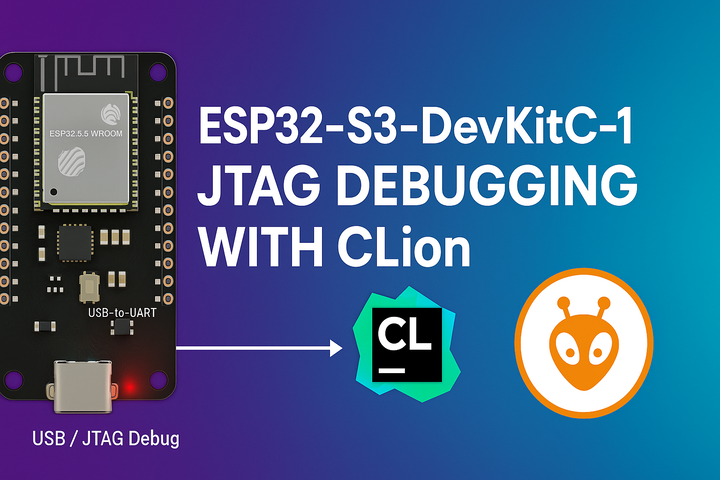

# ESP32-S3-DevKitC-1 JTAG Debugging with CLion



This guide provides step-by-step instructions for setting up JTAG debugging on the ESP32-S3-DevKitC-1 development board using CLion IDE and PlatformIO.

## Table of Contents

- [Hardware Requirements](#hardware-requirements)
- [Software Requirements](#software-requirements)
- [Hardware Setup](#hardware-setup)
- [Project Configuration](#project-configuration)
- [Debugging Process](#debugging-process)
- [Troubleshooting](#troubleshooting)
- [Sample Project](#sample-project)


## Hardware Requirements

- **ESP32-S3-DevKitC-1** development board
- **2x USB-C cables** (one for each USB port on the board)
- Computer with available USB ports

### ESP32-S3-DevKitC-1 Board Overview

The ESP32-S3-DevKitC-1 features two USB ports:

- **USB-to-UART Port**: Micro-USB port for programming and serial communication
- **USB Port**: USB-C port for native USB communication and **JTAG debugging**


> [!IMPORTANT]
> For JTAG debugging, you must use the **USB-C port**, not the Micro-USB port.

## Software Requirements

- **CLion IDE** (2023.1 or later recommended)
- **PlatformIO plugin** for CLion
- **ESP-IDF** (automatically managed by PlatformIO)
- **OpenOCD** (included with ESP-IDF)


## Hardware Setup

### Step 1: Connect the Board

1. Connect a USB-C cable from your computer to the **USB Port** (USB-C) on the ESP32-S3-DevKitC-1
2. Optionally, connect a Micro-USB cable to the **USB-to-UART Port** for serial monitoring (not required for debugging)


### Step 2: Verify Hardware Recognition

1. Open Device Manager (Windows) or check `lsusb` (Linux/macOS)
2. Look for the ESP32-S3 device in the USB devices list
3. Note the COM port assigned to the device

## Project Configuration

### Step 0: Install PlatformIO Plugin

1. Go to **File → Settings → Plugins**
2. Search for "PlatformIO for CLion"
3. Install and restart CLion


### Step 1: Create PlatformIO Project

1. Open CLion
2. Create a new PlatformIO project
3. Select **ESP32-S3-DevKitC-1** as the board
4. Choose **Arduino** framework

### Step 2: Configure platformio.ini

Create or modify your `platformio.ini` file with the following configuration:

```ini
[env:esp32-s3-devkitc-1]
platform = espressif32
board = esp32-s3-devkitc-1
framework = arduino
debug_tool = esp-builtin
debug_init_break = tbreak setup
build_type = debug
```

**Key Configuration Parameters:**

- `debug_tool = esp-builtin`: Uses the built-in JTAG debugger
- `debug_init_break = tbreak setup`: Sets initial breakpoint at setup function
- `build_type = debug`: Enables debug symbols

### Step 3: Sample Code

Here's a sample project that controls the onboard RGB LED:

```cpp
#define RGB_PIN 38
#define NUM_LEDS 1

#include <Arduino.h>
#include <FastLED.h>

CRGB leds[NUM_LEDS];

void setup() {
    CFastLED::addLeds<WS2812B, RGB_PIN, GRB>(leds, NUM_LEDS);
    FastLED.setBrightness(50);
}

void loop() {
    // Red
    leds[0] = CRGB::Red;
    FastLED.show();
    delay(1000);

    // Green
    leds[0] = CRGB::Green;
    FastLED.show();
    delay(1000);

    // Blue
    leds[0] = CRGB::Blue;
    FastLED.show();
    delay(1000);

    // Rainbow fade
    for (int i = 0; i < 255; i++) {
        leds[0] = CHSV(i, 255, 255);
        FastLED.show();
        delay(20);
    }
}
```

### Step 4: Build Configuration

1. In the top toolbar, ensure the correct target is selected: **esp32-s3-devkitc-1**
2. Build the project using **Build → Build Project** or `Ctrl+F9`


## Debugging Process

### Step 1: Prepare for Debugging

1. Ensure the ESP32-S3 is connected via **USB-C cable** to the USB Port
2. Build your project successfully
3. Upload the firmware to the board first (optional, but recommended)

### Step 2: Start Debug Session

1. Click the **Debug** button in the toolbar or press `Shift+F9`
2. CLion will automatically:
    - Launch OpenOCD
    - Connect to the ESP32-S3 via JTAG
    - Load the debug symbols
    - Stop at the initial breakpoint (setup function)


### Step 3: Debug Features

Once debugging starts, you can:

- **Set breakpoints**: Click in the gutter next to line numbers
- **Step through code**: Use F8 (Step Over), F7 (Step Into), Shift+F8 (Step Out)
- **Inspect variables**: Hover over variables or use the Variables panel
- **Evaluate expressions**: Use the Evaluate Expression dialog (Alt+F8)
- **View call stack**: Check the Call Stack panel
- **Monitor memory**: Use the Memory view

**Breakpoints**


**Inspect Variables**


**Memory View**


### Step 4: Debug Console Output

Monitor the OpenOCD and GDB output in the Debug Console:

```
(gdb) load
Loading section .iram0.vectors, size 0x403 lma 0x40374000
Loading section .iram0.text, size 0x129f1 lma 0x40374403
...
Transfer rate: 31 KB/sec, 2867 bytes/write.
(gdb) 
```


## Troubleshooting

### Common Issues and Solutions

#### Issue 1: "Failed to connect to ESP32-S3"

**Possible Causes:**

- Wrong USB port used (using Micro-USB instead of USB-C)
- Driver issues
- Board not in download mode

**Solutions:**

1. Ensure you're using the **USB-C port** for JTAG debugging
2. Install ESP32-S3 USB drivers
3. Try putting the board in download mode: Hold **Boot** button, press **Reset**, release **Reset**, then release **Boot**

#### Issue 2: "OpenOCD connection failed"

**Solutions:**

1. Check if another debug session is running
2. Restart CLion
3. Manually kill OpenOCD processes
4. Check USB cable connection

#### Issue 3: "Debug symbols not loaded"

**Solutions:**

1. Ensure `build_type = debug` is set in platformio.ini
2. Clean and rebuild the project
3. Check that the firmware was built with debug symbols

#### Issue 4: Breakpoints not working

**Solutions:**

1. Ensure the code was compiled with debug information
2. Check that breakpoints are set in executable code (not comments or empty lines)
3. Verify the firmware uploaded matches the debug symbols

### Verification Steps

To verify your setup is working correctly:

1. **Hardware Test**: The onboard LED should be visible and controllable
2. **Debug Test**: Set a breakpoint in the `setup()` function and verify it's hit
3. **Variable Inspection**: Check that you can inspect the `leds` array values
4. **Step Debugging**: Verify you can step through the code line by line


## Sample Project

This repository contains a complete sample project demonstrating:

- RGB LED control using FastLED library
- Proper JTAG debugging configuration
- Breakpoint usage examples
- Variable inspection demonstrations

### Project Structure

```
├── src/
│   └── main.cpp         # Main application code
├── platformio.ini       # PlatformIO configuration
├── README.md            # This documentation
└── images/              # Screenshots and diagrams
    ├── esp32-s3-board-layout.png
    ├── usb-connections.png
    ├── debug-interface.png
    └── ...
```


## Advanced Configuration

### Custom Debug Configuration

For advanced users, you can customize the debug configuration by creating a custom `launch.json`:

```json
{
  "version": "0.2.0",
  "configurations": [
    {
      "name": "PlatformIO Debugger",
      "type": "platformio-debug",
      "request": "launch",
      "environment": "esp32-s3-devkitc-1",
      "toolchainBinDir": "${platformio.toolchain_dir}/bin/",
      "svdPath": "${platformio.platform_dir}/misc/svd/esp32s3.svd"
    }
  ]
}
```

### OpenOCD Configuration

The default OpenOCD configuration should work for most cases, but you can customize it if needed:

```ini
debug_server =
    $PLATFORMIO_CORE_DIR/packages/tool-openocd-esp32/bin/openocd
    -f
    $PLATFORMIO_CORE_DIR/packages/tool-openocd-esp32/share/openocd/scripts/interface/esp_usb_jtag.cfg
    -f
    $PLATFORMIO_CORE_DIR/packages/tool-openocd-esp32/share/openocd/scripts/target/esp32s3.cfg
```


## Conclusion

This setup enables powerful debugging capabilities for ESP32-S3 development:

- Real-time variable inspection
- Step-by-step code execution
- Memory and register viewing
- Advanced breakpoint management

The built-in JTAG debugger of the ESP32-S3-DevKitC-1 provides a professional debugging experience without requiring external hardware debuggers.


## References

- [ESP32-S3-DevKitC-1 Getting Started Guide](https://docs.espressif.com/projects/esp-idf/en/latest/esp32s3/hw-reference/esp32s3/user-guide-devkitc-1.html)
- [PlatformIO Debugging Documentation](https://docs.platformio.org/en/latest/plus/debugging.html)
- [ESP-IDF JTAG Debugging](https://docs.espressif.com/projects/esp-idf/en/latest/esp32s3/api-guides/jtag-debugging/index.html)
- [CLion PlatformIO Plugin](https://www.jetbrains.com/help/clion/platformio.html)

<p align="center"></p>
<p align="center"><a href="https://sites.google.com/view/mchowdhury" target="_blank">Qatar University Machine Learning Group</a>
<p align="center"><a href="https://github.com/atick-faisal/ESP32-JTAG/blob/main/LICENSE"></a></p>
